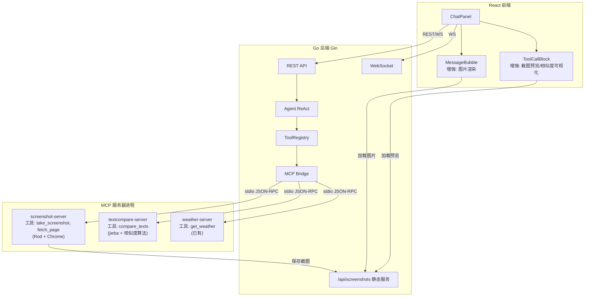

## 用户需求

为「网络侵权证据智能分析系统」补齐证据收集能力，聚焦于工具建设和前后端展示闭环。

## 产品概述

在现有的 ReAct Agent 对话系统基础上，新增三类证据收集 MCP 工具，并增强前端展示能力，使 Agent 能够在对话过程中自动调用工具进行证据采集，结果直接在聊天界面中可视化呈现，形成完整的证据收集闭环。

## 核心功能

### 1. 网页截图取证工具（MCP 服务器）

- 对目标 URL 进行全页面截图，输出 PNG 图片
- 返回截图的 base64 编码数据，供前端直接渲染
- 同时采集页面标题、URL、截图时间等元数据
- 截图存储到后端静态目录，返回可访问的 URL 路径

### 2. 增强版网页内容抓取工具（MCP 服务器）

- 在现有 web_fetch 基础上增强：支持 JavaScript 渲染后的页面内容抓取
- 提取页面结构化信息：标题、正文内容、发布时间、作者等元数据
- 自动保存页面 HTML 快照
- 返回清洗后的纯文本内容，便于后续比对分析

### 3. 文本相似度比对工具（MCP 服务器）

- 接收两段文本，计算多维度相似度（余弦相似度、Jaccard 系数、最长公共子序列比率）
- 输出综合相似度分数和各维度得分
- 标注相似片段的位置信息，返回结构化的比对结果
- 给出初步的抄袭/侵权判定建议

### 4. 前端展示增强

- MessageBubble 组件支持渲染图片（截图结果在对话中直接展示）
- ToolCallBlock 组件增强：截图类工具结果显示图片预览，文本比对结果显示相似度可视化（进度条、高亮差异）
- 支持 Markdown 中的图片语法渲染

## 技术栈

- **MCP 工具服务器**: Go（与现有 weather MCP 服务器保持一致）
- **网页截图**: Go + Rod（基于 Chrome DevTools Protocol 的浏览器自动化库，纯 Go 实现，无需 Node.js）
- **文本相似度**: 纯 Go 实现（分词 + 余弦相似度 + Jaccard + LCS）
- **后端**: 现有 Go + Gin 框架，增加静态文件服务
- **前端**: 现有 React + TypeScript

## 实现方案

### 整体策略

新增 2 个独立 MCP 服务器进程（screenshot 和 text-compare），增强版网页抓取整合到 screenshot 服务器中（因为都需要浏览器引擎）。每个 MCP 服务器遵循现有 weather 服务器的完整模式：独立 Go 程序、JSON-RPC 2.0 over stdio、在 `.mcp.json` 中注册。前端增强 MessageBubble 和 ToolCallBlock 组件的渲染能力。

### 关键技术决策

**1. 截图工具使用 Rod 而非 Playwright/Puppeteer**

- Rod 是纯 Go 库，无需 Node.js 运行时，与项目 Go 技术栈一致
- 通过 CDP 协议直接控制 Chrome/Chromium，性能优秀
- 自动下载管理浏览器二进制文件，部署简单

**2. 截图结果通过文件 URL 传递而非 base64 内联**

- MCP 工具返回文本结果，如果内联 base64 会导致上下文 token 爆炸（一张截图 ~500KB base64 = ~600K 字符）
- 方案：截图保存到 `server/data/screenshots/` 目录，后端新增静态文件路由 `/api/screenshots/:filename`，MCP 工具返回可访问的 URL 路径
- 前端从 URL 加载图片，Agent 上下文中只保留 URL 引用

**3. 增强版网页抓取合并到 screenshot MCP 服务器**

- 截图和增强抓取都需要浏览器引擎，共用一个 Rod 实例避免启动多个浏览器
- screenshot 服务器提供两个工具：`take_screenshot`（截图）和 `fetch_page`（增强抓取）

**4. 文本相似度使用纯 Go 实现**

- 中文分词使用 jieba-go（成熟的 Go 中文分词库）
- 余弦相似度基于 TF 向量计算
- Jaccard 基于分词集合交并比
- LCS 比率基于最长公共子序列算法
- 无外部服务依赖，作为独立 MCP 服务器运行

### MCP Bridge 适配

当前 Bridge 的 `RegisterAll()` 中，工具执行结果只取 `result.Content[0].Text`（bridge.go:58）。截图工具的结果是文本（JSON 含 URL），不需要修改 Bridge 层。前端根据工具名称和返回内容中的 URL 判断是否渲染图片。

## 实现细节

### 截图文件管理

- 截图保存路径: `server/data/screenshots/{timestamp}_{random}.png`
- MCP 服务器通过环境变量 `SCREENSHOT_DIR` 获取存储路径（在 `.mcp.json` 的 env 中配置）
- 后端 main.go 新增路由 `GET /api/screenshots/:filename` 提供静态文件访问
- 文件名安全检查：防止路径穿越

### WebSocket 消息无需修改

当前 tool_call 事件已经传递了完整的 result 文本，前端可以从 result 中解析 JSON 获取截图 URL，无需新增消息类型。

### 前端图片渲染策略

- MessageBubble 中增强 `formatContent` 函数，支持 Markdown 图片语法 `` 渲染为 `` 标签
- ToolCallBlock 中，对 `mcp_screenshot_take_screenshot` 工具的结果，解析 JSON 提取 `screenshotUrl` 字段，渲染图片预览
- 对 `mcp_textcompare_compare_texts` 工具的结果，解析 JSON 渲染相似度进度条和分数

### 性能考量

- Rod 浏览器实例在 MCP 服务器启动时初始化，复用连接，避免每次截图都启动新浏览器
- 截图超时限制 30 秒，页面加载超时 15 秒
- 文本比对中 LCS 算法 O(m*n) 复杂度，对超长文本（>10000 字符）降级为仅计算分词级相似度

### 错误处理

- 截图失败（页面加载超时、无效 URL）返回明确错误信息，Agent 可据此决策下一步
- 文本为空时返回错误提示
- 浏览器崩溃时自动重启 Rod 实例

## 架构设计



## 目录结构

```
server/
├── .mcp.json                                    # [MODIFY] 新增 screenshot 和 textcompare 两个 MCP 服务器配置
├── cmd/server/main.go                           # [MODIFY] 新增 /api/screenshots/:filename 静态文件路由，创建截图存储目录
├── mcp-servers/
│   ├── weather/                                 # (已有，不修改)
│   ├── screenshot/                              # [NEW] 截图+增强抓取 MCP 服务器
│   │   ├── main.go                              # [NEW] MCP 服务器主程序。实现 take_screenshot 和 fetch_page 两个工具。take_screenshot 使用 Rod 对 URL 进行全页面截图，保存为 PNG 并返回访问 URL 和元数据。fetch_page 使用 Rod 渲染页面后提取结构化内容（标题、正文、元数据）。共用一个浏览器实例。
│   │   └── go.mod                               # [NEW] 独立 Go 模块，依赖 go-rod/rod
│   └── textcompare/                             # [NEW] 文本相似度比对 MCP 服务器
│       ├── main.go                              # [NEW] MCP 服务器主程序。实现 compare_texts 工具，接收两段文本，使用 jieba 分词后计算余弦相似度、Jaccard 系数和 LCS 比率，返回综合评分和各维度得分的 JSON 结构。
│       └── go.mod                               # [NEW] 独立 Go 模块，依赖 jieba-go
client/src/
├── components/
│   ├── MessageBubble.tsx                        # [MODIFY] 增强 formatContent 函数：支持 Markdown 图片语法渲染，将  转为  标签。增加图片点击放大查看功能。
│   └── ToolCallBlock.tsx                        # [MODIFY] 增强工具结果展示：对截图工具结果解析 JSON 渲染图片预览缩略图；对文本比对工具结果解析 JSON 渲染相似度进度条、分维度得分和判定结论。增加结果最大显示长度到 2000 字符。
├── types/index.ts                               # [MODIFY] 新增 ScreenshotResult 和 TextCompareResult 类型定义，用于类型安全地解析工具返回的 JSON 结果。
└── App.css                                      # [MODIFY] 新增截图预览、图片弹窗、相似度进度条等样式。
```

## 关键代码结构

```typescript
// client/src/types/index.ts - 新增类型

/** 截图工具返回结果 */
interface ScreenshotResult {
  screenshotUrl: string
  pageTitle: string
  pageUrl: string
  timestamp: string
  viewport: { width: number; height: number }
}

/** 文本比对工具返回结果 */
interface TextCompareResult {
  overallScore: number        // 0.0 - 1.0 综合相似度
  cosineSimilarity: number    // 余弦相似度
  jaccardIndex: number        // Jaccard 系数
  lcsRatio: number            // LCS 比率
  verdict: string             // "高度相似" | "中度相似" | "低度相似" | "无明显相似"
  details: string             // 分析说明
}
```

```
// MCP 服务器工具定义结构（screenshot-server 中的两个工具）

// take_screenshot: 参数 { url: string, fullPage?: boolean }
//   返回: { screenshotUrl, pageTitle, pageUrl, timestamp, viewport }

// fetch_page: 参数 { url: string }
//   返回: { title, content, author, publishDate, url, html, metadata }

// compare_texts: 参数 { text1: string, text2: string }
//   返回: { overallScore, cosineSimilarity, jaccardIndex, lcsRatio, verdict, details }
```

## Agent Extensions

### Skill

- **browser-automation**
- 用途: 在开发截图 MCP 服务器时，可参考浏览器自动化的最佳实践和模式
- 预期结果: 确保截图工具的浏览器控制逻辑健壮可靠

### SubAgent

- **code-explorer**
- 用途: 在实现各模块时，搜索现有代码模式确保一致性（如 MCP 服务器模板代码、前端组件样式）
- 预期结果: 新代码与现有项目风格保持统一