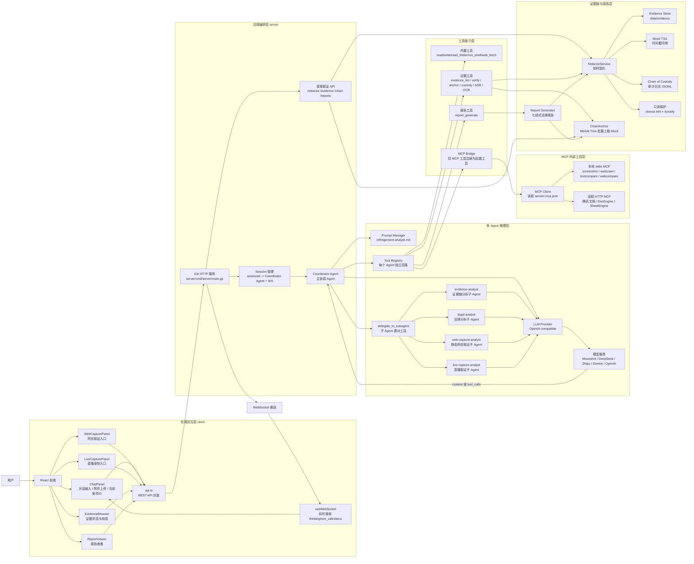
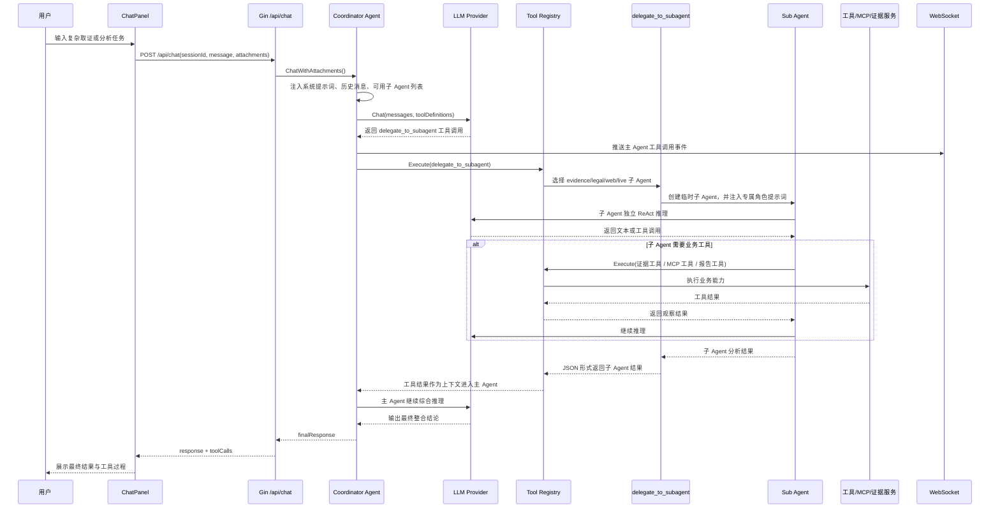

# 当前 Agent 架构设计

本文档基于当前项目代码梳理，描述网络侵权证据智能系统中的 Agent 架构、模块职责与请求流转关系。

## 1. 是否为多 Agent 架构

当前项目已经改造为**多 Agent 架构**。系统中存在一个主协调 Agent，以及若干面向具体任务的专业子 Agent。主 Agent 负责理解用户意图、拆解任务、选择工具和整合结论；子 Agent 负责处理证据链分析、法律分析、静态网页取证分析和直播取证分析等专业子任务。

当前内置子 Agent 包括：

| 子 Agent | 职责 |
|---|---|
| `evidence-analyst` | 证据链分析，负责证据清单、四值哈希链、TSA、上链与监督链校验。 |
| `legal-analyst` | 法律分析，负责商标、著作权、反不正当竞争与虚假宣传风险分析。 |
| `web-capture-analyst` | 静态网页取证分析，负责页面截图、HTML、OCR、素材相似度和网页证据组织。 |
| `live-capture-analyst` | 直播取证分析，负责直播分段、ASR、OCR、关键帧、多模态时间轴与重点证据定位。 |

主 Agent 通过 `delegate_to_subagent` 工具将明确子任务委派给指定子 Agent。子 Agent 拥有独立系统角色提示词和独立 ReAct 推理过程，但共享同一套模型 Provider 与业务工具能力。为避免递归委派，子 Agent 默认不再暴露 `delegate_to_subagent` 工具。

## 2. 总体架构图

## 3. 多 Agent 委派时序图

## 4. 当前架构设计要点

### 4.1 前端是“Agent + 取证控制台”

前端以 `ChatPanel` 为中心，除了普通对话外，还集成了直播取证、网页取证、证据浏览、报告查看和案件看板等功能。发送聊天消息时，前端会把当前 `caseId` 注入到用户消息中，使主 Agent 和子 Agent 在调用 `evidence_list`、`report_generate` 等工具时能够定位当前案件。

### 4.2 后端入口负责组装 Agent 运行环境

后端启动时依次完成配置加载、工具注册、MCP 连接、提示词管理器初始化、证据存储初始化、固化服务初始化、Mock 区块链服务初始化和报告生成器初始化。创建会话时，系统会创建一个主协调 Agent，并为该 Agent 克隆工具注册表，自动注册 `delegate_to_subagent` 委派工具。

### 4.3 主 Agent 与子 Agent 都采用 ReAct 循环

主 Agent 和子 Agent 的核心逻辑都位于 `server/internal/agent/agent.go`。每个 Agent 都维护独立的对话历史 `messages`，每轮将历史消息和工具定义发送给模型。如果模型返回 `tool_calls`，Agent 会通过 `ToolRegistry.Execute()` 执行工具，并把工具结果作为 `tool` 消息追加回上下文；如果模型没有继续调用工具，则将模型文本作为最终回复返回。

### 4.4 多 Agent 的关键实现点

多 Agent 改造的关键代码位于 `server/internal/agent/subagents.go`。系统新增了 `SubAgentSpec` 子 Agent 角色定义，并提供默认子 Agent 团队。`delegate_to_subagent` 工具接收 `agent`、`task` 和 `context` 参数，根据 `agent` 参数创建对应的临时子 Agent，注入专属角色提示词后执行子任务。

子 Agent 与主 Agent 共享同一个模型 Provider 和业务工具集合，因此可以继续调用证据工具、MCP 工具和报告工具。但子 Agent 会禁用 `delegate_to_subagent` 工具，避免出现子 Agent 继续无限委派其他子 Agent 的递归调用。

### 4.5 工具系统采用统一注册中心

所有工具最终都会注册到 `Tool Registry` 中，模型看到的是统一的函数工具列表。工具来源分为四类：

1. 多 Agent 工具：`delegate_to_subagent`；
2. 内置工具：文件读写、目录读取、Shell 命令、网页抓取等通用能力；
3. 业务工具：证据列表、证据校验、批量上链、监督链查询、ASR/OCR Mock、报告生成；
4. MCP 工具：通过 `MCP Bridge` 将外部 MCP Server 暴露的工具转换为 LLM function calling 工具。

### 4.6 MCP 是外部能力接入层

`server/.mcp.json` 中配置了本地 stdio MCP 与远程 HTTP MCP。当前包括截图、网页抓取、文本比对、网页比对、腾讯文档等工具。`MCP Client` 负责连接服务器、拉取工具列表、调用工具；`MCP Bridge` 负责把 MCP 工具改名为 `mcp_{server}_{tool}` 形式并注册到工具中心。

### 4.7 证据链能力既可以被 Agent 调用，也可以被前端 API 直接调用

系统中存在两条取证路径：

- Agent 自主路径：用户通过聊天提出任务，主 Agent 可以自行调用工具，也可以委派子 Agent 分析后再综合输出；
- 前端直接路径：用户点击网页取证、直播取证、证据校验、批量上链等按钮，直接调用 REST API。

两条路径最终都会汇入同一套证据固化与存证服务，包括 `NotarizeService`、`Evidence Store`、`Chain of Custody`、`ChainAnchor` 和 `Report Generator`。

## 5. 一句话概括

当前项目已经是**多 Agent 协作架构**：React 前端负责交互和取证入口，Gin 后端负责会话与服务编排，主协调 Agent 通过 ReAct 循环理解任务并调用 `delegate_to_subagent` 将专业子任务分发给证据链、法律、网页取证和直播取证子 Agent；各子 Agent 共享 MCP 与证据链工具能力，最终由主 Agent 整合形成“用户指令 → 多 Agent 分工 → 工具执行 → 证据固化 → 法律报告”的闭环。
