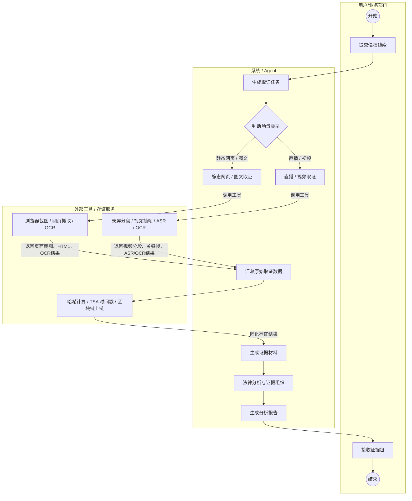

# 网络侵权证据处理业务活动图（修正版）

> 修正点：`判断场景类型` 后应当按取证场景进行分叉，而不是让“静态网页/图文取证”顺序流向“直播/视频取证”。静态网页取证与直播/视频取证是两个互斥分支，分别调用不同工具，之后再汇聚到统一的证据固化流程。

## 论文中可配套说明

该业务活动图描述了网络侵权证据处理从线索提交到报告交付的完整流程。用户提交侵权线索后，系统首先生成取证任务，并根据线索内容判断取证场景类型。若目标对象为商品详情页、图文页面或网页文章，则进入静态网页/图文取证分支，系统调用浏览器截图、网页抓取和 OCR 工具采集页面截图、HTML 源码、页面文本和图片识别结果；若目标对象为直播间、短视频或动态视频内容，则进入直播/视频取证分支，系统调用录屏分段、视频抽帧、ASR 语音识别和 OCR 画面识别工具采集多模态证据。

两类场景的原始取证数据采集完成后，流程统一汇聚到证据固化环节。系统对原始文件执行哈希计算、可信时间戳锚定和区块链摘要存证，形成可校验的证据链条。随后，系统基于已固化证据生成证据材料，并结合相关法律规范完成事实分析、证据组织和报告生成，最终向用户交付证据包和分析报告。
